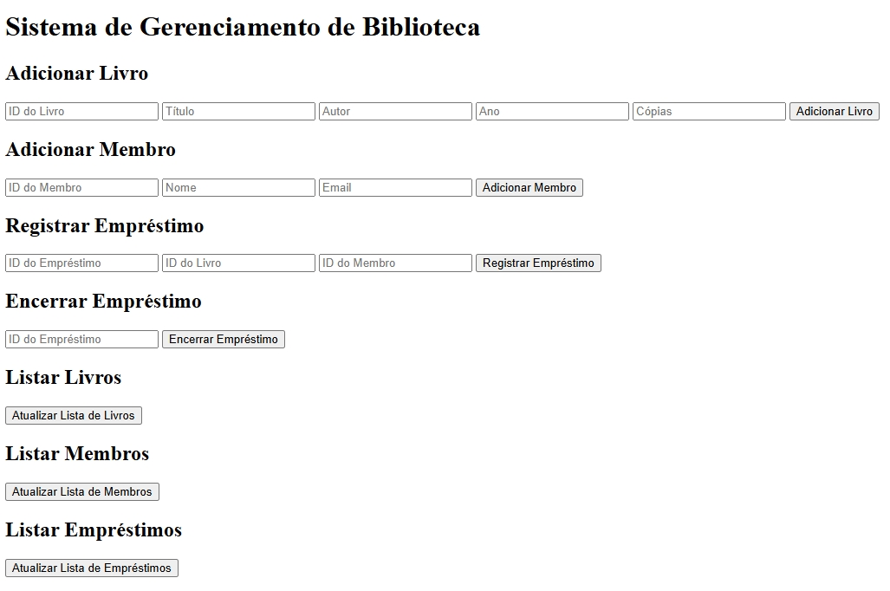

# Sistema de Gerenciamento de Biblioteca

Este é um sistema simples de gerenciamento de biblioteca que permite adicionar e listar livros, membros, e registrar ou encerrar empréstimos. O projeto usa JavaScript com uma interface HTML/CSS para facilitar a interação do usuário com o sistema.

## Interface

  

## Sumário

- [Tecnologias Utilizadas](#tecnologias-utilizadas)
- [Status](#status)
- [Descrição](#descrição)
- [Funcionalidades](#funcionalidades)
- [Explicação](#explicação)
- [Como Usar](#como-usar)
- [Autor](#autor)

## Tecnologias Utilizadas

  

    
  

  

    
  

  

    
  

## Status

## Descrição

Este projeto é um sistema de biblioteca desenvolvido para gerenciar o cadastro de livros e membros, e realizar o controle dos empréstimos. Ele permite ao usuário adicionar e listar livros e membros, registrar novos empréstimos e encerrar empréstimos em andamento. A interface HTML facilita a interação, enquanto o JavaScript gerencia a lógica do sistema usando Programação Orientada a Objetos (POO).

## Funcionalidades

- **Adicionar Livro**: Permite cadastrar livros no sistema com informações como ID, título, autor, ano de publicação e número de cópias disponíveis.
- **Adicionar Membro**: Permite cadastrar membros no sistema, com dados como ID, nome e e-mail.
- **Registrar Empréstimo**: Permite registrar um empréstimo entre um membro e um livro, verificando a disponibilidade de cópias.
- **Encerrar Empréstimo**: Permite encerrar um empréstimo ativo, atualizando a disponibilidade do livro.
- **Listar Livros, Membros e Empréstimos**: Exibe todas as informações cadastradas de livros, membros e empréstimos no sistema.

## Explicação

O sistema usa classes JavaScript para representar entidades como `Book`, `Member` e `Loan`, com uma classe `LibraryDB` para gerenciar as listas de cada entidade. A interação com o usuário ocorre no arquivo `index.html`, que exibe formulários e listas para realizar as operações.

Cada operação é gerida por métodos específicos na classe `App`, que utiliza `LibraryDB` como banco de dados em memória para armazenar as informações do sistema.

## Como Usar

1. Clone ou faça o download do repositório.
2. Abra o arquivo `index.html` em um navegador.
3. Use os formulários para adicionar livros e membros, registrar e encerrar empréstimos.
4. Clique em "Atualizar Lista" em cada seção para visualizar os itens registrados.

## Autor

Desenvolvido por Diego Franco
