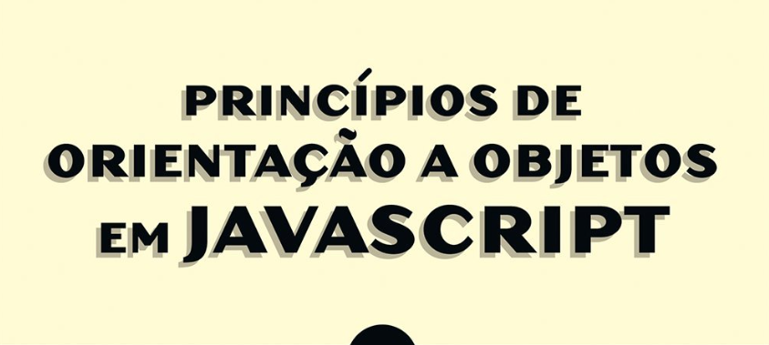

# javaScript e Orientação a Objetos (POO)

Um projeto que explora conceitos de programação orientada a objetos em JavaScript, criando e manipulando diferentes tipos de usuários como `User`, `Admin`, e `Docente`.

## Logo

  

## Sumário

- [Tecnologias Utilizadas](#tecnologias-utilizadas)
- [Status](#status)
- [Descrição](#descrição)
- [Funcionalidades](#funcionalidades)
- [Como Usar](#como-usar)
- [Estrutura do Projeto](#estrutura-do-projeto)
- [Autor](#autor)

## Tecnologias Utilizadas

  

    
  

## Status

<!--  -->

## Descrição

O projeto abrange a criação e manipulação de diferentes tipos de usuários (`User`, `Admin`, `Docente`) em JavaScript, demonstrando conceitos como herança, protótipos e criação de objetos.

## Funcionalidades

- Manipulação de propriedades privadas em classes.
- Extensão de classes para criar novos tipos de usuários.
- Demonstração de herança e prototipagem.

## Como Usar

1. Importe classes conforme necessário.
2. Crie instâncias de usuários e utilize métodos correspondentes.
3. Explore funcionalidades específicas de diferentes tipos de usuários.

## Estrutura do Projeto

- `User.js`: Define a classe `User` com propriedades privadas e métodos de acesso/modificação.
- `Admin.js`: Define a classe `Admin` que estende `User` e possui método específico para criação de curso.
- `index.js`: Importa a classe `Docente` e demonstra o uso do método `exibirInfos()`.
- `new.js`: Define um objeto literal chamado `user` com métodos `init` e `exibirInfos`.
- `docente.js`: Define a classe `Docente` que estende `User` e possui método específico para aprovar estudantes.
- `Objetoliteral.js`: Cria dois objetos literais (`user` e `admin`) com prototipagem entre eles.

## Autor

Desenvolvido por Diego Franco.
